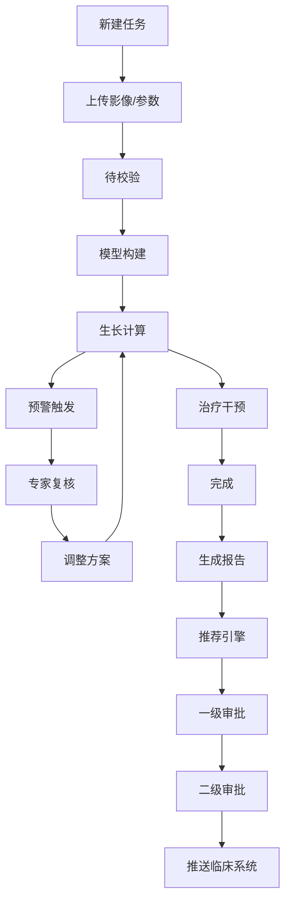

## 1. 产品概述

高精度肿瘤生长与治疗多尺度模拟及个性化方案优化平台，为临床肿瘤研究人员提供从病理影像输入到治疗方案推荐的全流程模拟支持。平台基于连续-离散耦合模型，实现肿瘤生长的高精度数值模拟，并通过智能推荐引擎和两级审批机制，辅助临床决策。

## 2. 核心功能

### 2.1 用户角色

| 角色 | 描述 | 核心权限 |
|------|------|----------|
| 研究员 | 平台主要使用者 | 创建任务、上传数据、查看模拟结果、发起复核 |
| 专家 | 复核预警和方案调整 | 审核预警、调整治疗方案、审批通过 |
| 首席科学家 | 高级管理员 | 两级审批终审、异常处置、查看性能看板 |
| 临床医生 | 接收推荐方案 | 查看推送的治疗方案、记录临床反馈 |

### 2.2 功能模块

1. **任务管理**：新建模拟任务、上传病理影像和细胞参数、任务列表展示
2. **模拟引擎**：连续-离散耦合模型构建、肿瘤生长计算、治疗干预模拟
3. **实时监测**：肿瘤体积追踪、坏死核心比例监测、多级预警推送
4. **专家复核**：预警审核、治疗方案调整、重新模拟触发
5. **报告中心**：三维形态预览、细胞密度热图、生存曲线、PDF报告生成
6. **数据导出**：按分期/治疗方案导出全场生长数据
7. **推荐引擎**：基于历史模拟的药物组合推荐
8. **审批流程**：两级审批、临床决策系统推送
9. **性能看板**：每日统计、完成率、响应时间、方案收敛次数

### 2.3 页面详情

| 页面名称 | 模块名称 | 功能描述 |
|----------|----------|----------|
| 任务列表页 | 任务概览 | 展示所有模拟任务、状态筛选、搜索、新建任务入口 |
| 新建任务页 | 任务创建 | 患者信息录入、病理影像上传、细胞参数配置 |
| 任务详情页 | 模拟监控 | 实时状态流转、体积/坏死曲线、三维形态可视化 |
| 预警复核页 | 专家审核 | 预警列表、阈值调整、方案修改、重新模拟 |
| 报告预览页 | 报告展示 | 三维形态、细胞密度热图、生存曲线、PDF下载 |
| 推荐中心页 | 方案推荐 | 历史模拟分析、药物组合推荐、推荐理由 |
| 审批中心页 | 审批管理 | 待审批列表、一级审批、二级审批、推送记录 |
| 性能看板页 | 数据统计 | 完成率、响应时间、方案收敛次数、趋势图表 |

## 3. 核心流程

用户上传病理影像和细胞参数后，系统自动构建连续-离散耦合模型并初始化微环境。任务状态沿"待校验-模型构建-生长计算-治疗干预-完成"流转，实时监测肿瘤体积与坏死核心比例，超阈值时触发多级预警。专家复核通过后自动调整治疗方案并重新模拟。完成后生成PDF报告，通过推荐引擎给出药物组合建议，经两级审批后推送至临床决策系统。

## 4. 用户界面设计

### 4.1 设计风格

**科技医疗风格**：以深蓝/青色为主色调，搭配白色和浅灰背景，营造专业、精准、可信赖的医疗科技氛围。

- 主色调：深海蓝 (#0B3D91) 代表专业与精准
- 辅助色：医疗青 (#00B4D8) 用于高亮和交互元素
- 警示色：警告橙 (#FF9500)、危险红 (#FF3B30)、成功绿 (#34C759)
- 字体：系统无衬线字体，清晰易读
- 布局：卡片式布局，清晰的信息层级
- 动效：平滑过渡，数据加载骨架屏，图表渐入动画

### 4.2 页面设计概览

| 页面名称 | 模块名称 | UI元素 |
|----------|----------|--------|
| 任务列表页 | 任务卡片 | 状态标签、进度条、患者信息卡片、操作按钮组 |
| 任务详情页 | 监控面板 | 实时曲线图、3D渲染区、状态时间线、预警提示 |
| 报告预览页 | 图表区域 | 热图、生存曲线、3D模型、数据表格 |
| 性能看板页 | 统计卡片 | KPI数字卡片、趋势折线图、柱状图、环形图 |

### 4.3 响应式

桌面端优先设计，支持1280px以上分辨率。关键数据区采用固定尺寸+内部滚动模式，确保大屏信息密度，小屏可滚动浏览。

### 4.4 三维可视化

- 肿瘤三维形态采用体素/等值面渲染
- 细胞密度热图使用颜色映射
- 支持旋转、缩放、切片等交互操作
- 加载时采用渐进式渲染策略
