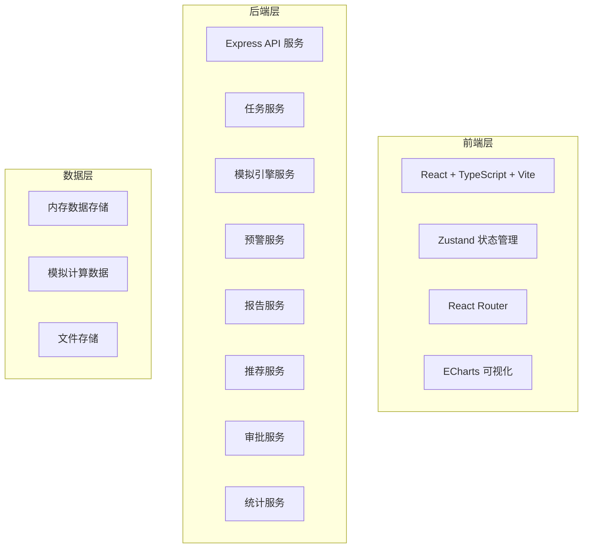
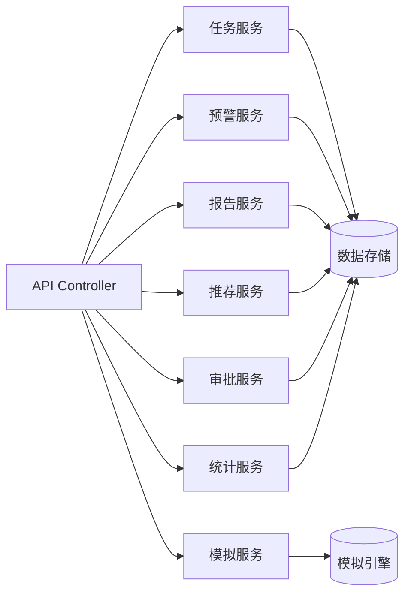
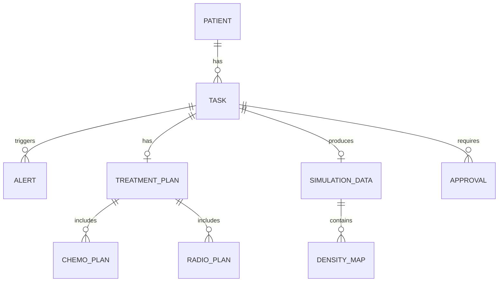

## 1. 架构设计



## 2. 技术描述

- **前端**：React 18 + TypeScript + Vite + TailwindCSS 3 + Zustand + React Router 6 + ECharts
- **初始化工具**：vite-init (react-express-ts 模板)
- **后端**：Express 4 + TypeScript + ESM
- **数据存储**：内存Mock数据 + 文件系统存储

## 3. 路由定义

| 前端路由 | 页面 | 说明 |
|----------|------|------|
| / | 任务列表 | 首页，展示所有模拟任务 |
| /tasks/new | 新建任务 | 创建新的模拟任务 |
| /tasks/:id | 任务详情 | 任务监控与模拟详情 |
| /alerts | 预警复核 | 预警列表与专家审核 |
| /reports/:id | 报告预览 | 模拟报告查看与下载 |
| /recommendations | 推荐中心 | 药物组合推荐 |
| /approvals | 审批中心 | 两级审批管理 |
| /dashboard | 性能看板 | 系统性能统计 |

## 4. API 定义

### 4.1 类型定义

```typescript
// 任务状态
type TaskStatus = 'pending_verify' | 'model_building' | 'growth_calculating' | 'treatment_intervening' | 'completed' | 'error_fallback';

// 患者信息
interface Patient {
  id: string;
  name: string;
  age: number;
  gender: 'male' | 'female';
  cancerType: string;
  stage: string;
}

// 细胞参数
interface CellParams {
  proliferationRate: number;
  apoptosisRate: number;
  migrationRate: number;
  nutrientThreshold: number;
  oxygenThreshold: number;
}

// 模拟任务
interface SimulationTask {
  id: string;
  patient: Patient;
  status: TaskStatus;
  createdAt: number;
  updatedAt: number;
  cellParams: CellParams;
  imageUrl?: string;
  currentVolume: number;
  necrosisRatio: number;
  baselineGrowthRate: number;
  alerts: Alert[];
  treatmentPlan?: TreatmentPlan;
  simulationData?: SimulationData;
}

// 预警
interface Alert {
  id: string;
  taskId: string;
  type: 'volume_spike' | 'necrosis_worsen';
  level: 'warning' | 'danger';
  message: string;
  createdAt: number;
  reviewed: boolean;
  reviewResult?: 'adjust_treatment' | 'continue';
}

// 治疗方案
interface TreatmentPlan {
  chemotherapy: ChemoPlan[];
  radiotherapy: RadioPlan[];
  adjustedAt?: number;
  adjustmentReason?: string;
}

// 模拟数据
interface SimulationData {
  timeline: number[];
  volumes: number[];
  necrosisRatios: number[];
  cellDensityMaps: DensityMap[];
  survivalCurve: SurvivalPoint[];
}
```

### 4.2 接口列表

| 方法 | 路径 | 说明 |
|------|------|------|
| GET | /api/tasks | 获取任务列表 |
| POST | /api/tasks | 创建新任务 |
| GET | /api/tasks/:id | 获取任务详情 |
| POST | /api/tasks/:id/start | 启动模拟 |
| POST | /api/tasks/:id/review-alert | 复核预警 |
| POST | /api/tasks/:id/adjust-treatment | 调整治疗方案并重模拟 |
| GET | /api/tasks/:id/report | 获取报告数据 |
| GET | /api/tasks/:id/report.pdf | 下载PDF报告 |
| GET | /api/alerts | 获取预警列表 |
| GET | /api/recommendations | 获取推荐方案 |
| GET | /approvals | 获取审批列表 |
| POST | /approvals/:id/approve | 审批通过 |
| GET | /api/stats/dashboard | 获取性能看板数据 |
| GET | /api/tasks/:id/export | 导出全场生长数据 |

## 5. 服务架构



## 6. 数据模型

### 6.1 ER图



### 6.2 核心实体

- **Patient**: 患者基本信息
- **SimulationTask**: 模拟任务主表，含状态流转
- **Alert**: 预警记录
- **TreatmentPlan**: 治疗方案
- **SimulationData**: 模拟结果数据
- **Approval**: 审批记录
